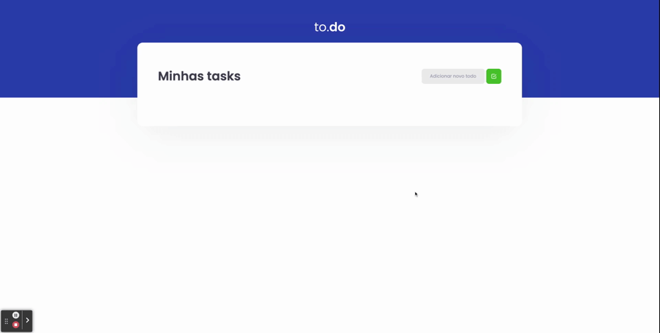
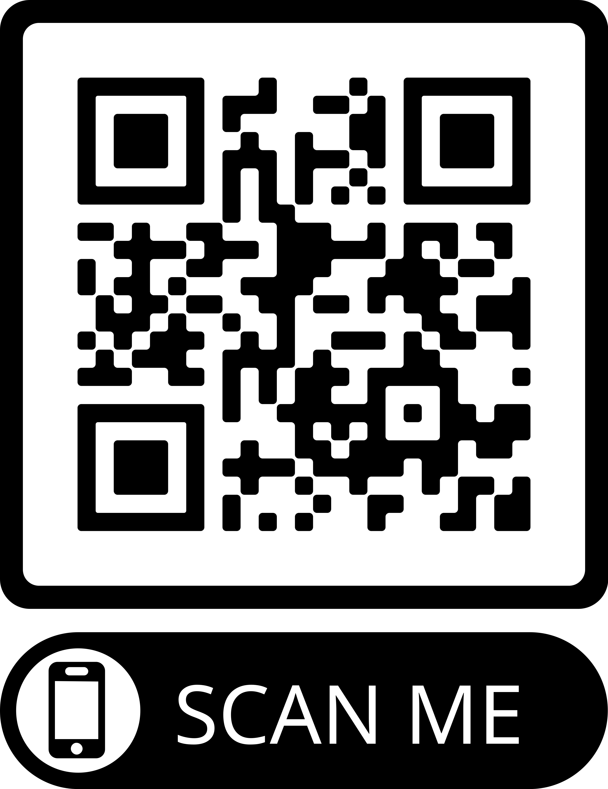

<h1 align="center">To.do</h1>

  <a href="#-technologies">Technologies</a>&nbsp;&nbsp;&nbsp;|&nbsp;&nbsp;&nbsp;
  <a href="#-how-to-run">How to run</a>&nbsp;&nbsp;&nbsp;|&nbsp;&nbsp;&nbsp;
  <a href="#-license">License</a>

  

  

## ✨ Technologies

This project was developed with the following technologies:

- [React](https://pt-br.reactjs.org/)
- [TypeScript](https://www.typescriptlang.org/)
- [Sass](https://sass-lang.com/)

## 🚀 How to run

- Clone the repository and access the folder;
- Install the dependencies with `yarn`;
- Start the server with `yarn dev`;

The application can be accessed at [`localhost:8080`](http://localhost:8080)

You can access the live web application [`clicking here`](https://ignite-challenge-01.netlify.app/).

  

## 📄 License

This project is under the MIT license. See the [LICENSE](LICENSE) file for more details.

---

Made with ♥ by Julio Zittei 👋🏻
